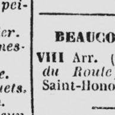
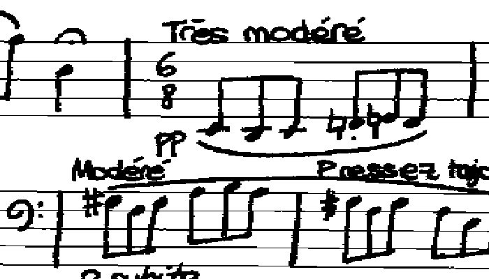
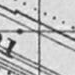
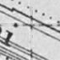

# bernet.23.icdar
Experimental protocol and results for the paper "Linear Object Detection in Document Images using Multiple Object Tracking" [accepted at ICDAR 2023](https://icdar2023.org/program/accepted-papers/) by Bernet et al.

---

## Examples of possible applications

Old directory (cropped):
| Original | Vectorial line detection | Rotation |
|-----|------|-------|
| |  |  |

Staff lines:
| Original | Staff lines line detection |
|-----|-------------|
| |  |


Old map (cropped):
| Original | Line detection | Removed geographical lines |
|-----|------|-------|
| |  |  |


---

## Requirements

```bash
python -m venv pylene_line_detection_venv
source pylene_line_detection_venv/bin/activate
pip install -r requirements.txt
```

The pylene library uses the conan (version >= 2.0) package manager to install dependencies. You can install it using pip:
```bash
pip install conan
```

Opencv C++ is required. Due to a conflict with pylene and opencv on libpng version using conan, we recommend to install using your package manager.
```bash
sudo apt-get install libopencv-dev
```

## Build line detectors

```bash
cd line_detectors/build
conan remote add lrde-public https://artifactory.lrde.epita.fr/artifactory/api/conan/lrde-public
conan install .. --output-folder=. -s build_type=Release -s compiler.cppstd=20 -s compiler.libcxx=libstdc++11 --build missing --build freeimage* --build openjpeg*
cmake .. -DCMAKE_TOOLCHAIN_FILE=./conan_toolchain.cmake
make -j
```

## Download datasets

Datasets are available here : [](https://doi.org/10.5281/zenodo.7927611)

**Set the path in the file [lsd_path_dataset.py](lsd_path_dataset.py)**

## Run the experiments

Use respecting the order the following notebooks:
-  [benchmark_run.py](benchmark_notebook/benchmark_run.py): to run the benchmark
-  [benchmark_score.py](benchmark_notebook/benchmark_score.py): to score the benchmark
-  [benchmark_visualize.py](benchmark_notebook/benchmark_visualize.py): to output the graphs

## Demo

The notebook [demo/demo.ipynb](demo/demo.ipynb) contains some code to test the line detectors. You can add your own image in the `demo/image` folder. **Image must be 8b-grayscale.**

# Citation

If you use or found this code, evaluation, and/or dataset, please cite:

```
@InProceedings{bernet.23.icdar,
  author    = {Philippe Bernet and Joseph Chazalon and Edwin Carlinet and Alexandre Bourquelot and Elodie Puybareau},
  title     = {Linear Object Detection in Document Images using Multiple Object Tracking},
  booktitle = {Proceedings of the 17th International Conference on Document Analysis and Recognition},
  year      = {2023},
  address   = {San José, California, USA},
  month     = {08},
  publisher = {Springer},
  note      = {To appear.},
}
```

TODO add link to arXiv version of the paper.
