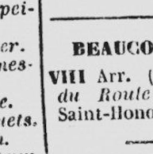

# bernet.23.icdar
Experimental protocol and results for the paper "Linear Object Detection in Document Images using Multiple Object Tracking" [accepted at ICDAR 2023](https://icdar2023.org/program/accepted-papers/) by Bernet et al.

📝 The complete article is available here : [https://arxiv.org/abs/2305.16968](https://arxiv.org/abs/2305.16968)

🆕 Live demo on HF available at <https://huggingface.co/spaces/Sefray/PylenaLineDetector_ICDAR2023>
[](https://huggingface.co/spaces/Sefray/PylenaLineDetector_ICDAR2023)
---

# Scribo Line Detector

## Examples of possible applications of the line detector

Old directory (cropped): Separator detection for document rotation.
| Original | Vectorial line detection | Rotation |
|-----|------|-------|
| |  |  |

Staff lines: Staff lines line detection for music score recognition.
| Original | Staff lines line detection |
|-----|-------------|
| |  |

Old map (cropped): Line detection for line removal of geographical lines.
| Original | Line detection | Removed geographical lines |
|-----|------|-------|
| |  |  |

All line detection outputs are reproductible in the [demo/demo.ipynb](demo/demo.ipynb) notebook.

---

## Python API

The line detector is available on the PyPI server and can be simply installed with pip by executing the following command:
```bash
pip install pylena
```

A complete documentation and examples are available [here](http://olena.pages.lre.epita.fr/pylena/). Call examples are present in the demo notebook [demo/demo.ipynb](demo/demo.ipynb).

## C++ API

The line detector is included in the Pylene library.

A complete documentation on the installation and examples are available [here](http://olena.pages.lre.epita.fr/pylene/next/tutorial/installation). Call example is present in [line_detectors/pylene-ours/main.cc](line_detectors/pylene-ours/main.cc).

# Datasets

Datasets are available here : [](https://doi.org/10.5281/zenodo.7927611)

**Set the path in the file [lsd_path_dataset.py](lsd_path_dataset.py)**

# Evaluation

The line detection evaluation is available in the *evaluation* folder.
Evaluation is performed using Python.

There are two different evaluation:
- vectorial evaluation: the line detection is evaluated using the vectorial representation of the lines.
- pixel evaluation: the line detection is evaluated as a segmentation task.

# Benchmarks

## Requirements

```bash
python -m venv pylene_line_detection_venv
source pylene_line_detection_venv/bin/activate
pip install -r requirements.txt
```

## Line detectors C++ builds 

The pylene library uses the conan (version >= 2.0) package manager to install dependencies. You can install it using pip:
```bash
pip install conan
```

Opencv C++ is required. Due to a conflict with pylene and opencv on libpng version using conan, we recommend to install using your package manager.
```bash
sudo apt-get install libopencv-dev
```

## Build line detectors

```bash
cd line_detectors/build
conan remote add lrde-public https://artifactory.lrde.epita.fr/artifactory/api/conan/lrde-public
conan install .. --output-folder=. -s build_type=Release -s compiler.cppstd=20 -s compiler.libcxx=libstdc++11 --build missing --build freeimage* --build openjpeg*
cmake .. -DCMAKE_TOOLCHAIN_FILE=./conan_toolchain.cmake
make -j
```

## Demo interactive

The notebook [demo/demo_interactive.ipynb](demo/demo_interactive.ipynb) contains some code to test the C++ builded line detectors.
Using this notebook, you will be able to compare the line detectors on your own images.
You can add your own image in the `demo/image` folder. **Image must be 8b-grayscale.**

## Run the benchmarks

Use respecting the order the following notebooks:
-  [benchmark_run.ipynb](benchmark_notebook/benchmark_run.ipynb): to run the benchmark
-  [benchmark_score.ipynb](benchmark_notebook/benchmark_score.ipynb): to score the benchmark
-  [benchmark_visualize.ipynb](benchmark_notebook/benchmark_visualize.ipynb): to output the graphs

# Citation

If you use or found this code, evaluation, and/or dataset useful, please cite:

```
@InProceedings{bernet.23.icdar,
  author    = {Philippe Bernet and Joseph Chazalon and Edwin Carlinet and Alexandre Bourquelot and Elodie Puybareau},
  title     = {Linear Object Detection in Document Images using Multiple Object Tracking},
  booktitle = {Proceedings of the 17th International Conference on Document Analysis and Recognition},
  year      = {2023},
  address   = {San José, California, USA},
  month     = {08},
  publisher = {Springer},
  note      = {To appear.},
}
```
